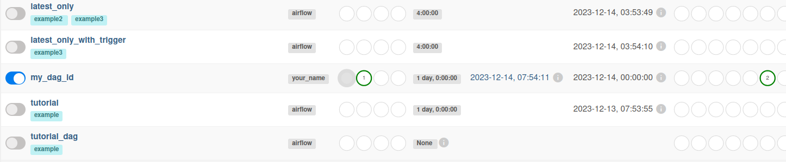

# Installing Apache Airflow on Linux

## Installing dependencies

Open a terminal and enter the following commands:
```bash
sudo apt-get update
sudo apt-get upgrade
sudo apt-get install -y python3-pip python3-dev
sudo apt-get install -y libmysqlclient-dev
sudo apt-get install -y libssl-dev
sudo apt-get install -y libffi-dev
sudo apt-get install -y libblas-dev liblapack-dev libatlas-base-dev
```

## Virtual environment
Let's create a virtual environment using Python 3. A virtual environment creates an isolated environment for installing and running applications, which avoids conflicts between dependencies of different projects.
```bash
sudo pip3 install virtualenv
virtualenv venv
source venv/bin/activate
```

Now it looks like this:
```bash
(venv) username@ubuntu:~$ 
```

## Installing Apache Airflow
```bash
pip install apache-airflow
```

## Validate Airflow installation by typing this into the terminal
```bash
airflow version
```
Your version should be printed. I have this: 2.8.0

## Initializing the Airflow Database
```bash
airflow db init
```

## Creating a user (Fill in the fields yourself)
```bash
airflow users create \
    --username admin \
    --firstname YourFirstName \
    --lastname YourLastName \
    --role Admin \
    --email your.email@example.com
```
Enter your password in the terminal window (only required once when creating the user for the first time)

# Apache Airflow on Lunux Ubuntu - Start

## To run Apache Airflow, do: 1. and 2. in seperate terminal windows

1. To start the Airflow web server, paste this into the first window and hit Enter:
```bash
source venv/bin/activate
airflow webserver -p 8080
```

2. To start Airflow scheduler, paste this into the seconed window and hit Enter:
```bash
source venv/bin/activate
airflow scheduler
```

### Now you can go to Airflow web frontend - Open in the browser (DO THIS):
```bash
localhost:8080
```

### To stop airflow webserver:
find the process id: (assuming 8080 is the port)
```bash
lsof -i tcp:8080
```
kill it
```bash
kill <pid>
```
Or Ctrl + c in the window to interrupt. (DO THIS)

# Adding your own DAGs
## Create a directory with dags (continue to work in a virtual environment)
```bash
mkdir ~/airflow/dags
```

## Create a new file named “test_dag.py” and paste your code written in Python into it:
```bash
nano ~/airflow/dags/test_dag.py
```

## Examle DAG:
```bash
from datetime import datetime, timedelta
from airflow import DAG
from airflow.operators.dummy_operator import DummyOperator

# Setting DAG parameters
default_args = {
    'owner': 'airflow',
    'depends_on_past': False,
    'start_date': datetime(2023, 1, 1),
    'email_on_failure': False,
    'email_on_retry': False,
    'retries': 1,
    'retry_delay': timedelta(minutes=5),
}

# Creating DAG
dag = DAG(
    'test_dag',
    default_args=default_args,
    description='A simple test DAG',
    schedule_interval=timedelta(days=1),
)

# Defining operators
start_task = DummyOperator(task_id='start_task', dag=dag)
end_task = DummyOperator(task_id='end_task', dag=dag)

# Defining the execution order of operators
start_task >> end_task
```
Save the file and close the editor (Ctrl+s => Ctrl+x). 

## Now you can run the added DAG
Testing DAG execution:
```bash
airflow test test_dag start_task <date_of_completion>
```

Starting DAG execution:
```bash
airflow trigger_dag test_dag
```

Starting a specific task in a DAG:
```bash
airflow run test_dag start_task date_of_completion>
```

Or do it manually via the web interface.

After launch, if no errors occur, you will see success in the field: Status of all previous DAG runs.
